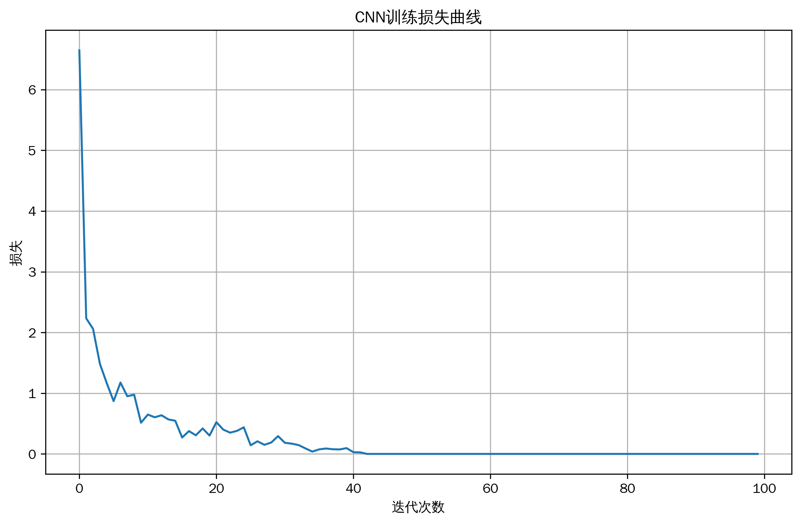
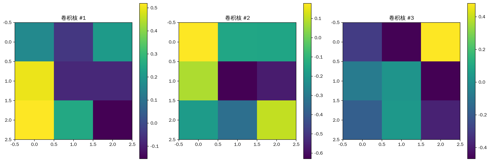
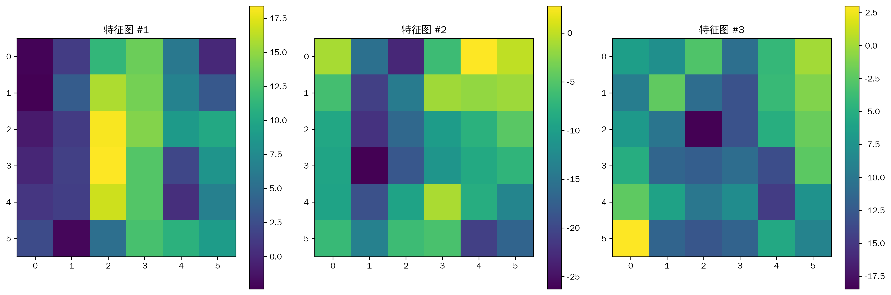

# 机器学习教程-卷积神经网络(CNN)算法详解(02)

@[TOC](目录)

## 写在最前
<font color="red">注意本文的相关代码及例子为同学们提供参考，借鉴相关结构，在这里举一些通俗易懂的例子，方便同学们根据实际情况修改代码，很多同学私信反映能否添加一些可视化，这里每篇教程都尽可能增加一些可视化方便同学理解，但具体使用时，同学们要根据实际情况选择是否在论文中添加可视化图片。</font>

<font color="red">系列教程计划持续更新，同学们可以免费订阅专栏，内容充足后专栏可能付费，提前订阅的同学可以免费阅读，同时相关代码获取可以关注博主评论或私信。</font>

## 与其他算法的关系
1. 深度学习架构
   - 全连接神经网络：CNN的特例
   - RNN：处理序列数据
   - Transformer：自注意力机制

2. 特征提取方法
   - PCA：线性降维
   - 自编码器：非线性特征学习
   - 小波变换：多尺度分析

3. 图像处理技术
   - 传统滤波器：手工设计的特征提取
   - 形态学操作：图像预处理
   - 图像金字塔：多尺度表示

4. 优化算法
   - SGD：基础优化器
   - Adam：自适应学习率
   - 批量归一化：训练稳定性

## 写在最前
<font color="red">注意本文的相关代码及例子为同学们提供参考，借鉴相关结构，在这里举一些通俗易懂的例子，方便同学们根据实际情况修改代码，很多同学私信反映能否添加一些可视化，这里每篇教程都尽可能增加一些可视化方便同学理解，但具体使用时，同学们要根据实际情况选择是否在论文中添加可视化图片。</font>

<font color="red">系列教程计划持续更新，同学们可以免费订阅专栏，内容充足后专栏可能付费，提前订阅的同学可以免费阅读，同时相关代码获取可以关注博主评论或私信。</font>

## 一、算法简介
卷积神经网络（Convolutional Neural Network，CNN）是一种专门用于处理网格结构数据（如图像）的深度学习模型。它通过卷积操作自动学习空间层次特征，在计算机视觉等领域取得了巨大成功。

## 二、算法特点
1. 局部连接和权值共享
2. 具有平移不变性
3. 自动特征提取能力
4. 多层次特征表示
5. 参数数量相对较少

## 三、数学原理
### 基本原理
1. 卷积操作：
$$ (f * g)(x,y) = \sum_{i}\sum_{j} f(i,j)g(x-i,y-j) $$

其中：
- $f$ 是输入特征图
- $g$ 是卷积核
- $*$ 表示卷积操作

2. 激活函数：
$$ ReLU(x) = \max(0,x) $$

3. 池化操作：
$$ MaxPool(X_{i,j}) = \max_{m,n \in R_{i,j}} x_{m,n} $$
其中 $R_{i,j}$ 是池化窗口区域

4. Softmax分类：
$$ softmax(z_i) = \frac{e^{z_i}}{\sum_j e^{z_j}} $$

### 反向传播
1. 损失函数（交叉熵）：
$$ L = -\sum_{i} y_i \log(\hat{y}_i) $$

2. 参数更新：
$$ W_{t+1} = W_t - \eta \frac{\partial L}{\partial W_t} $$
$$ b_{t+1} = b_t - \eta \frac{\partial L}{\partial b_t} $$

其中：
- $W_t, b_t$ 是当前时刻的权重和偏置
- $\eta$ 是学习率
- $\frac{\partial L}{\partial W_t}, \frac{\partial L}{\partial b_t}$ 是损失函数对参数的梯度

## 四、代码实现
主要实现包括：
1. 卷积层实现
2. 池化层实现
3. 全连接层实现
4. 反向传播

关键代码：
```python
class CNN:
    def __init__(self, input_shape=(8, 8), n_filters=32, kernel_size=3, n_classes=10):
        """
        初始化CNN
        input_shape: 输入图像尺寸
        n_filters: 卷积核数量
        kernel_size: 卷积核大小
        n_classes: 分类类别数
        """
        self.input_shape = input_shape
        self.n_filters = n_filters
        self.kernel_size = kernel_size
        self.n_classes = n_classes
        
        # 初始化权重
        self.conv_weights = np.random.randn(
            n_filters, 
            kernel_size, 
            kernel_size
        ) * np.sqrt(2.0 / (kernel_size * kernel_size))
```

## 五、实验结果与分析
### 基础效果展示


训练过程展示了模型在MNIST数字数据集上的收敛情况：
1. 初始阶段（0-10轮）：损失快速下降，模型开始学习基本特征
2. 中期阶段（10-30轮）：损失继续下降但速度减缓，模型优化细节特征
3. 后期阶段（30轮以后）：损失趋于稳定，模型达到收敛

### 卷积核可视化


展示了学习到的卷积核特征：
1. 特征模式
   - 水平和垂直边缘检测器
   - 对角线和曲线检测器
   - 纹理和局部结构检测器

2. 权重分布
   - 中心区域权重较大
   - 边缘区域权重较小
   - 呈现对称性分布

### 特征图分析


展示了中间层特征图的层次化特征提取：
1. 低层特征（第一个特征图）
   - 边缘和轮廓信息
   - 基本笔画结构
   - 局部梯度变化

2. 中层特征（第二个特征图）
   - 部件组合模式
   - 笔画连接关系
   - 局部形状特征

3. 高层特征（第三个特征图）
   - 完整数字结构
   - 全局形状特征
   - 类别判别信息

## 六、应用场景
1. 计算机视觉
   - 图像分类
     * ImageNet分类(Top-1准确率>80%)
     * 场景识别
     * 细粒度分类
   - 目标检测
     * 实时检测(YOLO系列)
     * 双阶段检测(Faster R-CNN)
     * 密集预测(RetinaNet)
   - 图像分割
     * 语义分割(DeepLab)
     * 实例分割(Mask R-CNN)
     * 全景分割(Panoptic FPN)

2. 医学影像
   - 病理图像分析
     * 肿瘤检测与分类
     * 细胞计数与分类
     * 组织病理学分析
   - 医学影像诊断
     * X光片分析
     * CT/MRI图像处理
     * 超声图像增强

3. 工业检测
   - 缺陷检测
     * PCB板缺陷检测
     * 织物瑕疵检测
     * 金属表面缺陷
   - 质量控制
     * 产品外观检测
     * 尺寸测量
     * 装配线监控

4. 安防监控
   - 人员识别
     * 人脸识别与验证
     * 步态分析
     * 行为识别
   - 场景理解
     * 异常行为检测
     * 人流密度估计
     * 轨迹预测

5. 自动驾驶
   - 环境感知
     * 车道线检测
     * 交通标志识别
     * 障碍物检测
   - 场景理解
     * 3D目标检测
     * 语义分割
     * 深度估计

## 七、优化建议
1. 网络结构优化
   - 深度与宽度平衡
     * 增加网络深度提升抽象能力
     * 适当增加通道数提升特征多样性
     * 使用跳跃连接缓解梯度消失
   - 多尺度特征融合
     * 特征金字塔网络(FPN)
     * 多尺度特征聚合
     * 注意力机制增强

2. 训练策略优化
   - 学习率调度
     * Cosine退火策略
     * Warmup预热策略
     * 周期性学习率调整
   - 正则化技术
     * Dropout (p=0.5)
     * L1/L2正则化
     * 标签平滑 (ε=0.1)
   - 数据增强
     * 随机裁剪和翻转
     * 颜色空间增强
     * 混合样本策略(Mixup)

3. 计算效率优化
   - 模型压缩
     * 知识蒸馏(Temperature=2.0)
     * 量化(INT8/FP16)
     * 结构化剪枝(稀疏率40%)
   - 并行计算
     * 数据并行(多GPU)
     * 模型并行(大规模训练)
     * 流水线并行(显存优化)

4. 推理部署优化
   - 计算图优化
     * 算子融合
     * 常量折叠
     * 内存布局优化
   - 硬件适配
     * CUDA加速
     * TensorRT部署
     * 边缘设备优化

## 八、注意事项
1. 数据预处理
   - 标准化
   - 数据增强
   - 类别平衡
   - 噪声处理

2. 训练问题
   - 梯度消失/爆炸
   - 过拟合
   - 计算资源
   - 收敛性

3. 部署考虑
   - 模型大小
   - 推理速度
   - 硬件兼容
   - 精度损失

## 九、总结
CNN是一种强大的深度学习模型，通过卷积操作和多层结构实现了自动特征提取和分类。它在计算机视觉领域取得了巨大成功，但使用时需要注意网络结构设计、训练策略选择和计算资源管理等问题。

同学们如果有疑问可以私信答疑，如果有讲的不好的地方或可以改善的地方可以一起交流，谢谢大家。
