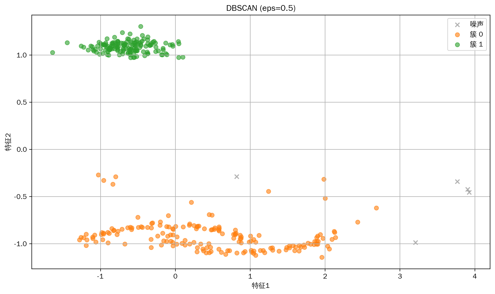
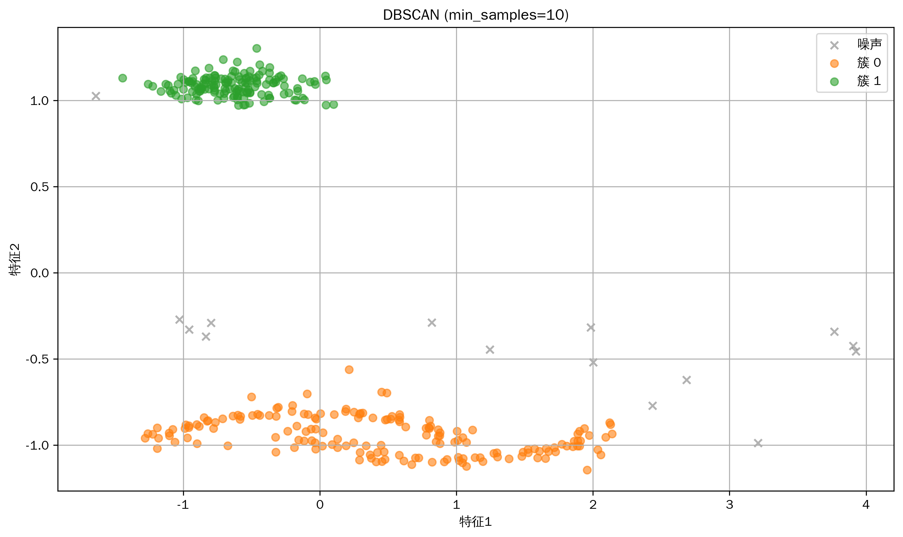

# 机器学习教程-基于密度的空间聚类(DBSCAN)算法详解(05)

## 与其他算法的关系
1. 聚类算法家族
   - K-means：基于中心点的聚类
   - GMM：基于概率密度的聚类
   - 层次聚类：基于层次结构的聚类

2. 密度估计方法
   - KDE：核密度估计
   - LOF：局部离群因子
   - OPTICS：有序点密度聚类

3. 异常检测
   - Isolation Forest：基于孤立性
   - One-Class SVM：基于支持向量
   - Autoencoder：基于重构误差

4. 空间索引
   - KD树：空间分割
   - R树：矩形区域索引
   - Ball树：球形区域索引

@[TOC](目录)

## 写在最前
<font color="red">注意本文的相关代码及例子为同学们提供参考，借鉴相关结构，在这里举一些通俗易懂的例子，方便同学们根据实际情况修改代码，很多同学私信反映能否添加一些可视化，这里每篇教程都尽可能增加一些可视化方便同学理解，但具体使用时，同学们要根据实际情况选择是否在论文中添加可视化图片。</font>

<font color="red">系列教程计划持续更新，同学们可以免费订阅专栏，内容充足后专栏可能付费，提前订阅的同学可以免费阅读，同时相关代码获取可以关注博主评论或私信。</font>

## 一、算法简介
DBSCAN（Density-Based Spatial Clustering of Applications with Noise）是一种基于密度的聚类算法，它能够发现任意形状的簇，并且能够自动识别噪声点。该算法的核心思想是通过考察数据点的密度来形成簇，密度由邻域内的点数量来定义。

## 二、算法特点
1. 可以发现任意形状的簇
2. 对噪声具有鲁棒性
3. 不需要预先指定簇的数量
4. 只需要两个参数（eps和min_samples）
5. 能够自动识别噪声点

## 三、数学原理
### 基本概念
1. ε-邻域（eps-neighborhood）：
```
N_ε(p) = {q ∈ D | dist(p,q) ≤ ε}
其中：
- p 是核心点
- D 是数据集
- dist(p,q) 是距离函数
```

2. 核心点（Core Point）：
```
|N_ε(p)| ≥ MinPts
其中：
- |N_ε(p)| 是p点的ε-邻域内的点数
- MinPts 是最小点数阈值
```

3. 密度可达（Density-Reachable）：
```
如果存在点链 p₁,...,pₙ，其中：
- p₁ = q
- pₙ = p
- pᵢ₊₁ ∈ N_ε(pᵢ)
- |N_ε(pᵢ)| ≥ MinPts
则称p从q密度可达
```

### 算法步骤
1. 对于每个未访问的点p：
   - 计算p的ε-邻域
   - 如果邻域内点数≥MinPts，则开始一个新簇

2. 对于新簇中的每个点：
   - 计算其ε-邻域
   - 如果是核心点，将其邻域内的点加入簇

3. 重复步骤2直到没有新的点可以加入簇

## 四、代码实现
主要实现包括：
1. 邻域计算
2. 核心点判断
3. 簇的扩展
4. 噪声点识别

关键代码：
```python
class DBSCAN:
    def __init__(self, eps=0.3, min_samples=5):
        """
        初始化DBSCAN
        eps: 邻域半径
        min_samples: 核心点的最小邻域样本数
        """
        self.eps = eps
        self.min_samples = min_samples
        self.labels_ = None
        
    def _get_neighbors(self, X, point_idx):
        """获取邻域内的点"""
        distances = np.sqrt(np.sum((X - X[point_idx])**2, axis=1))
        return np.where(distances <= self.eps)[0]
```

## 五、实验结果与分析
### 基础效果展示


基础模型展示了DBSCAN在复杂形状数据上的聚类效果。可以看到：
- 成功识别非球形簇
- 准确标记噪声点
- 自动确定簇的数量
- 边界点处理合理

### 不同eps值的比较


比较了不同eps值的效果：
- eps=0.2：簇较为分散，可能过分细化
- eps=0.3：较好的平衡，簇的形状合理
- eps=0.5：簇可能过度合并，损失细节

### 不同min_samples值的比较


展示了不同min_samples值的影响：
- min_samples=3：较多小簇，噪声点较少
- min_samples=5：平衡的簇大小和噪声识别
- min_samples=10：较大的簇，更多噪声点

### 不同噪声水平的比较


比较了不同噪声水平的聚类效果：
- 低噪声：簇边界清晰，结构明显
- 中等噪声：仍能保持主要结构
- 高噪声：簇的识别变得困难

## 六、应用场景
1. 空间数据分析
   - 地理信息聚类
   - 天文数据分析
   - 城市规划

2. 异常检测
   - 信用卡欺诈检测
   - 网络入侵检测
   - 传感器异常识别

3. 图像处理
   - 图像分割
   - 目标检测
   - 场景分析

4. 生物信息学
   - 基因表达分析
   - 蛋白质结构聚类
   - 分子动力学

## 七、优化建议
1. 参数选择
   - 使用k-距离图选择eps
   - 根据数据维度调整min_samples
   - 考虑数据规模和密度分布

2. 性能优化
   - 使用空间索引结构（KD树、Ball树）
   - 并行计算邻域搜索
   - 批处理大规模数据

3. 预处理策略
   - 特征标准化
   - 降维处理
   - 异常值检测

4. 算法改进
   - 自适应eps
   - 层次化DBSCAN
   - 增量式更新

## 八、注意事项
1. 数据特征
   - 对数据尺度敏感
   - 需要合适的距离度量
   - 高维数据可能需要降维

2. 参数敏感性
   - eps值选择关键
   - min_samples影响聚类粒度
   - 不同区域密度差异大时效果可能不理想

3. 计算复杂度
   - 时间复杂度O(n²)
   - 空间复杂度O(n)
   - 大规模数据需要优化

## 九、总结
DBSCAN是一种强大的基于密度的聚类算法，能够发现任意形状的簇并识别噪声点。它不需要预先指定簇的数量，但参数选择对结果有重要影响。在实际应用中，需要根据数据特点选择合适的参数和优化策略。

同学们如果有疑问可以私信答疑，如果有讲的不好的地方或可以改善的地方可以一起交流，谢谢大家。
