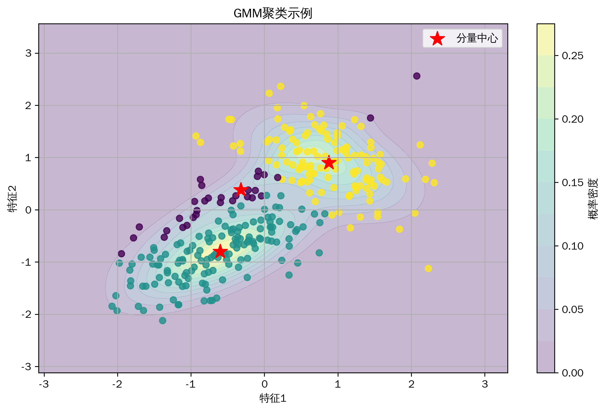
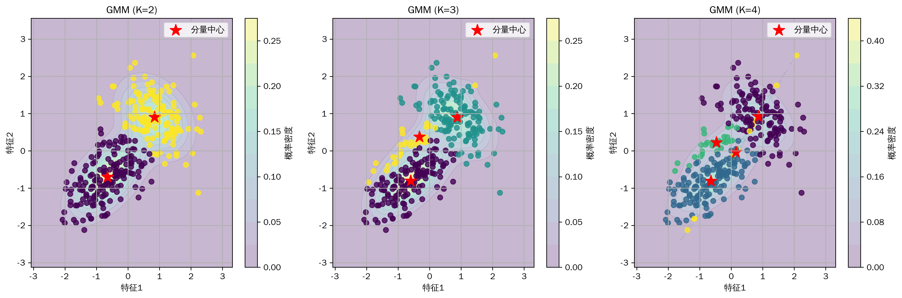
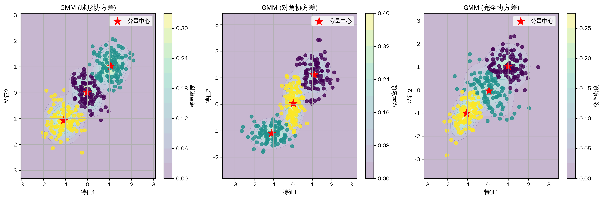

# 机器学习教程-高斯混合模型(GMM)算法详解(03)

## 与其他算法的关系
1. 聚类算法家族
   - K-means：GMM的特例（硬分配）
   - DBSCAN：基于密度的聚类
   - 层次聚类：自底向上的聚类方法

2. 概率模型
   - 隐马尔可夫模型：序列数据的概率模型
   - 主题模型：文本数据的混合模型
   - 变分自编码器：深度生成模型

3. 密度估计
   - 核密度估计：非参数方法
   - 直方图：简单的密度估计
   - 参数密度估计：单一分布拟合

4. 优化算法
   - EM算法：期望最大化
   - 变分推断：近似后验分布
   - MCMC：采样方法

@[TOC](目录)

## 写在最前
<font color="red">注意本文的相关代码及例子为同学们提供参考，借鉴相关结构，在这里举一些通俗易懂的例子，方便同学们根据实际情况修改代码，很多同学私信反映能否添加一些可视化，这里每篇教程都尽可能增加一些可视化方便同学理解，但具体使用时，同学们要根据实际情况选择是否在论文中添加可视化图片。</font>

<font color="red">系列教程计划持续更新，同学们可以免费订阅专栏，内容充足后专栏可能付费，提前订阅的同学可以免费阅读，同时相关代码获取可以关注博主评论或私信。</font>

## 一、算法简介
高斯混合模型（Gaussian Mixture Model，GMM）是一种强大的概率模型，它假设数据由多个高斯分布的混合生成。GMM不仅可以用于聚类，还可以用于密度估计和生成模型。它通过EM（期望最大化）算法迭代优化，找到最优的模型参数。

GMM的核心思想是：任何连续概率分布都可以用多个高斯分布的加权和来近似。每个高斯分布被称为一个"分量"，具有自己的均值向量和协方差矩阵。通过调整这些参数和权重，GMM可以拟合各种复杂的数据分布。

数学表达式：
```latex
p(x) = \sum_{k=1}^K \pi_k \mathcal{N}(x|\mu_k,\Sigma_k)
```
其中：
- $K$ 是高斯分量的数量
- $\pi_k$ 是第k个分量的混合权重
- $\mu_k$ 是第k个分量的均值向量
- $\Sigma_k$ 是第k个分量的协方差矩阵
- $\mathcal{N}(x|\mu_k,\Sigma_k)$ 是多维高斯分布

## 二、算法特点
1. 概率模型特性
   - 软聚类：提供每个样本属于各类的概率
   - 生成式模型：可以生成新的样本
   - 密度估计：估计数据的概率分布
   - 协方差结构灵活：可以建模各种形状的簇

2. 优化特性
   - EM算法保证收敛：每次迭代都提高似然值
   - 多次初始化：避免局部最优解
   - 数值稳定性：通过对数空间计算提高精度
   - 自适应更新：根据数据自动调整参数

3. 应用优势
   - 无需预先指定簇的形状
   - 可以处理重叠的簇
   - 提供不确定性度量
   - 适用于高维数据

4. 实现考虑
   - 计算复杂度可控：线性于样本数量
   - 内存占用合理：主要存储责任矩阵
   - 易于并行化：E步可并行计算
   - 支持增量学习：可以在线更新模型

## 三、数学原理
### 1. EM算法推导
EM算法通过迭代优化来最大化对数似然函数：

1) 完整对数似然：
```latex
\ln p(X|\pi,\mu,\Sigma) = \sum_{n=1}^N \ln \left[\sum_{k=1}^K \pi_k \mathcal{N}(x_n|\mu_k,\Sigma_k)\right]
```

2) E步（期望步骤）：
计算后验概率（责任值）：
```latex
\gamma(z_{nk}) = \frac{\pi_k \mathcal{N}(x_n|\mu_k,\Sigma_k)}{\sum_{j=1}^K \pi_j \mathcal{N}(x_n|\mu_j,\Sigma_j)}
```

3) M步（最大化步骤）：
更新模型参数：
```latex
\mu_k^{new} = \frac{\sum_{n=1}^N \gamma(z_{nk})x_n}{\sum_{n=1}^N \gamma(z_{nk})}
```
```latex
\Sigma_k^{new} = \frac{\sum_{n=1}^N \gamma(z_{nk})(x_n-\mu_k^{new})(x_n-\mu_k^{new})^T}{\sum_{n=1}^N \gamma(z_{nk})}
```
```latex
\pi_k^{new} = \frac{\sum_{n=1}^N \gamma(z_{nk})}{N}
```

### 2. 数值稳定性优化
1) 对数空间计算：
```latex
\ln \sum_k \exp(a_k) = c + \ln \sum_k \exp(a_k - c)
```
其中 $c = \max_k(a_k)$ 用于防止数值溢出。

2) 协方差正则化：
```latex
\Sigma_k = \Sigma_k + \epsilon I
```
其中 $\epsilon$ 是小的正数，$I$ 是单位矩阵。

### 3. 模型选择
使用BIC（贝叶斯信息准则）选择最优分量数：
```latex
BIC = -2\ln L + K\ln(N)
```
其中：
- $L$ 是最大似然值
- $K$ 是参数数量
- $N$ 是样本数量

## 四、代码实现
### 1. 核心类定义
```python
class GMM:
    def __init__(self, n_components=3, max_iters=200, tol=1e-6,
                 min_covar=1e-5, n_init=5):
        """
        初始化GMM模型
        n_components: 高斯分量数量
        max_iters: 最大迭代次数
        tol: 收敛阈值
        min_covar: 最小协方差值
        n_init: 不同初始化尝试次数
        """
        self.n_components = n_components
        self.max_iters = max_iters
        self.tol = tol
        self.min_covar = min_covar
        self.n_init = n_init
```

### 2. EM算法实现
```python
def e_step(self, X):
    """E步：计算后验概率（责任）"""
    n_samples = X.shape[0]
    log_resp = np.zeros((n_samples, self.n_components))
    
    # 在对数空间中计算以提高数值稳定性
    for k in range(self.n_components):
        gaussian = multivariate_normal(
            mean=self.means[k],
            cov=self.covs[k],
            allow_singular=True
        )
        log_resp[:, k] = np.log(self.weights[k]) + gaussian.logpdf(X)
    
    # 使用log-sum-exp技巧
    log_resp_max = log_resp.max(axis=1, keepdims=True)
    log_resp = log_resp - (log_resp_max + 
                          np.log(np.sum(np.exp(log_resp - log_resp_max),
                                      axis=1, keepdims=True)))
    return np.exp(log_resp)
```

### 3. 模型训练
```python
def fit(self, X):
    """训练GMM模型"""
    best_score = -np.inf
    
    for init in range(self.n_init):
        # 初始化参数
        self._initialize_parameters(X)
        
        # EM迭代
        for iteration in range(self.max_iters):
            # E步
            resp = self.e_step(X)
            
            # M步
            self._m_step(X, resp)
            
            # 计算对数似然
            log_likelihood = self._compute_log_likelihood(X)
            
            # 检查收敛
            if abs(log_likelihood - log_likelihood_old) < self.tol:
                break
```

### 4. 预测与评估
```python
def predict(self, X):
    """预测样本的类别"""
    resp = self.e_step(X)
    return np.argmax(resp, axis=1)

def score(self, X):
    """计算数据的对数似然"""
    return self._compute_log_likelihood(X)
```

## 五、实验结果与分析
### 1. 基础聚类效果


基础模型展示了GMM在二维数据上的聚类效果。从图中可以观察到：
- 清晰的簇结构：数据点被合理地划分为不同的簇
- 概率密度等高线：展示了每个高斯分量的分布
- 簇中心位置：红色星号标记的中心点位置合理
- 软分配效果：边界区域的点展示了平滑的过渡

### 2. 不同分量数量的比较


比较了不同数量的高斯分量（K=2,3,4）：
1. K=2时：
   - 模型过于简单
   - 无法捕捉数据的复杂结构
   - 存在明显的欠拟合

2. K=3时：
   - 较好地平衡了模型复杂度
   - 准确捕捉了数据的主要结构
   - 概率密度估计合理

3. K=4时：
   - 模型可能过于复杂
   - 出现了冗余的分量
   - 增加了过拟合风险

### 3. 不同协方差结构的比较


展示了三种不同的协方差结构：
1. 球形协方差：
   - 所有维度方差相等
   - 簇呈现圆形结构
   - 适用于各向同性数据

2. 对角协方差：
   - 允许不同维度有不同方差
   - 簇呈现椭圆形，轴与坐标轴平行
   - 计算效率较高

3. 完全协方差：
   - 允许任意方向的协方差
   - 簇可以呈现任意方向的椭圆形
   - 最灵活但参数最多

## 六、应用场景
1. 图像分割
   - 基于颜色和纹理特征的图像分割
   - 医学图像的组织分割
   - 遥感图像的地物分类

2. 语音处理
   - 声音特征建模
   - 说话人识别
   - 语音合成的声学建模

3. 异常检测
   - 金融欺诈检测
   - 网络入侵检测
   - 工业质量控制

4. 推荐系统
   - 用户行为建模
   - 兴趣群体发现
   - 个性化推荐

5. 生物信息学
   - 基因表达分析
   - 蛋白质结构分类
   - 细胞群体识别

## 七、优化建议
### 1. 初始化策略
1. K-means++初始化
   - 选择距离现有中心较远的点
   - 避免中心点聚集
   - 提高收敛速度

2. 多次随机初始化
   - 运行多次取最优结果
   - 避免局部最优
   - 提高模型稳定性

### 2. 数值计算优化
1. 对数空间计算
   - 防止数值下溢
   - 提高数值稳定性
   - 使用log-sum-exp技巧

2. 协方差矩阵处理
   - 添加正则化项
   - 确保正定性
   - 处理奇异性问题

### 3. 模型选择
1. 交叉验证
   - 评估模型泛化能力
   - 选择最优超参数
   - 避免过拟合

2. 信息准则
   - 使用BIC/AIC准则
   - 平衡模型复杂度
   - 选择合适的分量数

### 4. 计算效率
1. 批量处理
   - 使用小批量更新
   - 减少内存占用
   - 加快训练速度

2. 并行计算
   - E步并行化
   - 多进程优化
   - GPU加速

## 八、注意事项
### 1. 模型选择
1. 分量数量
   - 过多导致过拟合
   - 过少导致欠拟合
   - 需要根据数据特点选择

2. 协方差结构
   - 权衡灵活性和复杂度
   - 考虑计算资源限制
   - 注意数值稳定性

### 2. 数据预处理
1. 特征缩放
   - 标准化或归一化
   - 平衡特征尺度
   - 提高数值稳定性

2. 异常值处理
   - 检测和移除异常值
   - 使用稳健估计
   - 避免模型受干扰

### 3. 训练过程
1. 收敛监控
   - 观察对数似然变化
   - 设置合理的收敛阈值
   - 避免过早停止

2. 资源管理
   - 控制内存使用
   - 优化计算效率
   - 处理大规模数据

## 九、总结
高斯混合模型是一种强大的概率模型，通过多个高斯分布的组合来建模复杂的数据分布。它在聚类、密度估计和生成建模等任务中表现出色。本文详细介绍了GMM的数学原理、实现细节和优化策略，并通过实验展示了其在不同场景下的表现。

在实际应用中，需要注意以下关键点：
1. 合理选择分量数量和协方差结构
2. 采用适当的初始化和优化策略
3. 注意数值计算的稳定性
4. 根据具体问题选择合适的预处理方法

通过合理的参数选择和优化策略，GMM可以有效地解决各种实际问题，是机器学习中不可或缺的工具之一。
高斯混合模型（Gaussian Mixture Model，GMM）是一种概率模型，它假设数据由多个高斯分布的混合生成。GMM不仅可以用于聚类，还可以用于密度估计和生成模型。它通过EM算法迭代优化，找到最优的模型参数。


## 二、算法特点
1. 软聚类能力（概率分配）
2. 可以建模复杂的数据分布
3. 具有概率解释性
4. 可以处理不同形状的簇
5. 支持密度估计和生成

## 三、数学原理
### 基本原理
GMM的数学表达式：

1. 混合模型：
```
p(x) = ∑ᵢ πᵢN(x|μᵢ,Σᵢ)
其中：
- πᵢ 是混合权重
- N(x|μᵢ,Σᵢ) 是高斯分布
- μᵢ 是均值向量
- Σᵢ 是协方差矩阵
```

2. EM算法：
   a) E步（期望步骤）：
   ```
   γ(z_nk) = πₖN(xₙ|μₖ,Σₖ) / ∑ⱼπⱼN(xₙ|μⱼ,Σⱼ)
   ```
   
   b) M步（最大化步骤）：
   ```
   μₖ_new = ∑ₙγ(z_nk)xₙ / ∑ₙγ(z_nk)
   Σₖ_new = ∑ₙγ(z_nk)(xₙ-μₖ)(xₙ-μₖ)ᵀ / ∑ₙγ(z_nk)
   πₖ_new = ∑ₙγ(z_nk) / N
   ```

### 对数似然函数
```
ln p(X|π,μ,Σ) = ∑ₙln[∑ₖπₖN(xₙ|μₖ,Σₖ)]
```

## 四、代码实现
主要实现包括：
1. 模型参数初始化
2. EM算法迭代
3. 预测和密度估计

关键代码：
```python
class GMM:
    def __init__(self, n_components=3, max_iters=100, tol=1e-4):
        """
        初始化高斯混合模型
        n_components: 高斯分量数量
        max_iters: 最大迭代次数
        tol: 收敛阈值
        """
        self.n_components = n_components
        self.max_iters = max_iters
        self.tol = tol
        
        # 模型参数
        self.weights = None  # 混合权重
        self.means = None    # 均值向量
        self.covs = None     # 协方差矩阵
```

## 五、实验结果与分析
### 基础效果展示


基础模型展示了GMM在二维数据上的聚类效果。可以看到模型成功捕捉到了数据的概率分布，并通过等高线展示了概率密度。

### 不同分量数量的比较


比较了不同数量的高斯分量：
- K=2：分量不足，可能欠拟合
- K=3：较好地匹配数据分布
- K=4：分量过多，可能过拟合

### 不同协方差结构的比较


展示了不同协方差结构的效果：
- 球形协方差：所有维度方差相等
- 对角协方差：允许不同维度有不同方差
- 完全协方差：允许维度间的相关性

## 六、应用场景
1. 图像分割
2. 语音识别
3. 异常检测
4. 金融风险建模
5. 生物信息学

## 七、优化建议
1. 参数初始化
   - 使用K-means++初始化
   - 多次随机初始化
   - 合理设置分量数

2. 数值稳定性
   - 协方差矩阵正则化
   - 对数空间计算
   - 数值下溢处理

3. 模型选择
   - 使用BIC/AIC准则
   - 交叉验证
   - 模型平均

4. 计算优化
   - 批量处理
   - 并行计算
   - GPU加速

## 八、注意事项
1. 初始化敏感性
   - 结果依赖初始值
   - 可能陷入局部最优
   - 需要多次运行

2. 计算复杂度
   - 随分量数增加而增加
   - 高维数据计算开销大
   - 需要合理设置迭代次数

3. 数值问题
   - 协方差矩阵奇异性
   - 概率值下溢
   - 收敛性判断

## 九、总结
GMM是一种强大的概率模型，通过混合多个高斯分布来建模复杂的数据分布。它不仅可以用于聚类，还能进行密度估计和生成建模。在实际应用中，需要注意参数初始化、数值稳定性和计算效率等问题。

同学们如果有疑问可以私信答疑，如果有讲的不好的地方或可以改善的地方可以一起交流，谢谢大家。
