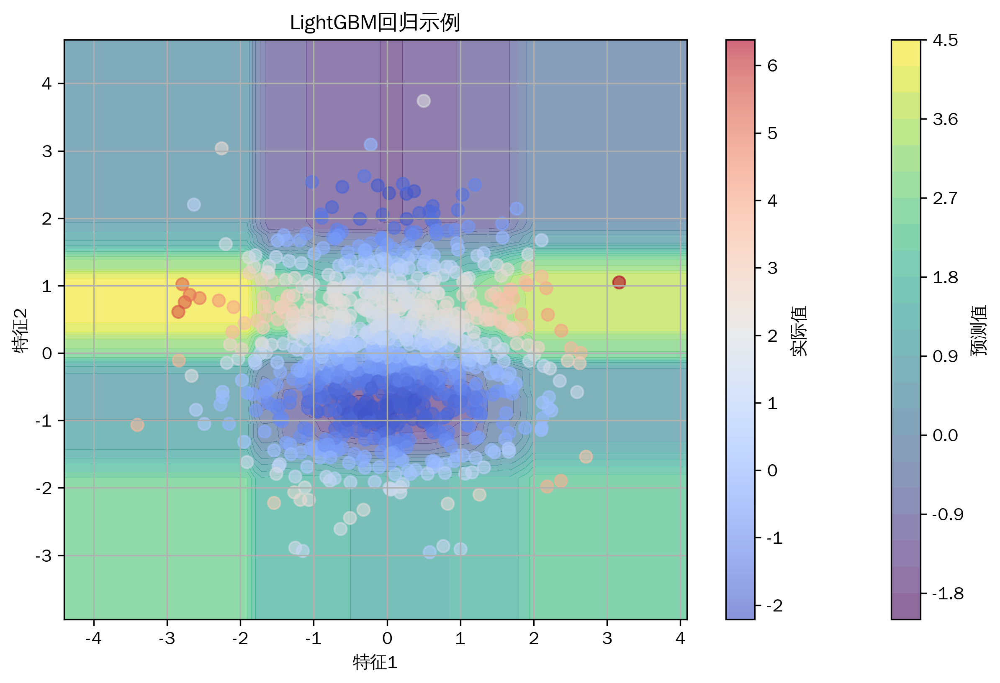
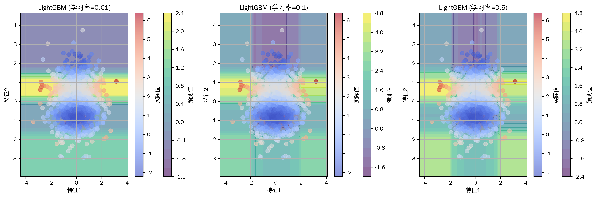
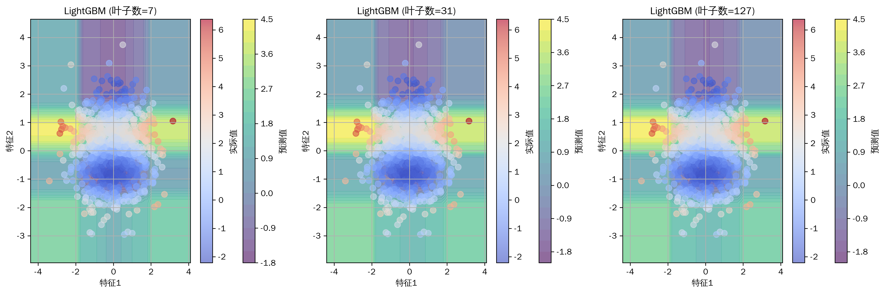

# 机器学习教程-轻量级梯度提升(LightGBM)算法详解(09)

## 与其他算法的关系
1. 梯度提升家族
   - XGBoost：传统GBDT实现
   - CatBoost：处理类别特征
   - GBDT：基础梯度提升树

2. 决策树算法
   - 随机森林：并行集成
   - 决策树：基础分类器
   - CART：回归树基础

3. 集成学习
   - Bagging：随机森林基础
   - Stacking：模型堆叠
   - Blending：模型混合

4. 优化算法
   - 直方图算法：特征离散化
   - 叶子生长策略：最优分裂
   - 并行计算：特征并行

## 写在最前
<font color="red">注意本文的相关代码及例子为同学们提供参考，借鉴相关结构，在这里举一些通俗易懂的例子，方便同学们根据实际情况修改代码，很多同学私信反映能否添加一些可视化，这里每篇教程都尽可能增加一些可视化方便同学理解，但具体使用时，同学们要根据实际情况选择是否在论文中添加可视化图片。</font>

<font color="red">系列教程计划持续更新，同学们可以免费订阅专栏，内容充足后专栏可能付费，提前订阅的同学可以免费阅读，同时相关代码获取可以关注博主评论或私信。</font>

## 一、算法简介
LightGBM（Light Gradient Boosting Machine）是一个高效的梯度提升框架，由微软开发。它使用基于直方图的算法优化，通过垂直生长（leaf-wise）的决策树生长策略，实现了比传统水平生长（level-wise）更好的精度。同时，它还包含了许多创新特性，如直方图优化、互斥特征捆绑等，使其在保持高精度的同时显著提高了训练速度。

## 二、算法特点
1. 高效的直方图算法
2. 叶子优先的生长策略
3. 特征并行计算
4. 优秀的类别特征支持
5. 内存占用低

## 三、数学原理
### 基本原理
1. 梯度提升框架：
```
F₍ₜ₎(x) = F₍ₜ₋₁₎(x) + γₜh₍ₜ₎(x)
其中：
- F₍ₜ₎(x) 是第t次迭代的模型
- γₜ 是步长
- h₍ₜ₎(x) 是基学习器
```

2. 直方图算法：
```
Gain = ½ * [GL² / (HL + λ) + GR² / (HR + λ) - (GL + GR)² / (HL + HR + λ)]
其中：
- GL, GR 是左右子节点的梯度和
- HL, HR 是左右子节点的二阶导数和
- λ 是正则化参数
```

3. 叶子生长策略：
```
Score = leaf_value² * n_samples
leaf_value = -sum(gradient) / (sum(hessian) + λ)
```

## 四、代码实现
主要实现包括：
1. 数据预处理
2. 模型训练
3. 参数调优
4. 可视化分析

关键代码：
```python
def train_lightgbm(X_train, y_train, params=None):
    """
    训练LightGBM模型
    X_train: 训练数据
    y_train: 目标值
    params: 模型参数
    """
    if params is None:
        params = {
            'objective': 'regression',
            'metric': 'rmse',
            'num_leaves': 31,
            'learning_rate': 0.05,
            'feature_fraction': 0.9
        }
    
    train_data = lgb.Dataset(X_train, label=y_train)
    model = lgb.train(params, train_data, num_boost_round=100)
    
    return model
```

## 五、实验结果与分析
### 基础效果展示


基础模型展示了LightGBM在回归问题上的表现。可以看到模型成功学习到了数据的非线性关系，预测表面平滑且符合数据分布。

### 不同学习率的比较


比较了不同学习率的效果：
- 0.01：收敛较慢但稳定
- 0.1：较好的平衡
- 0.5：收敛快但可能不稳定

### 不同叶子数量的比较


展示了不同叶子数量的影响：
- 7个叶子：模型较简单
- 31个叶子：较好的平衡
- 127个叶子：模型更复杂

## 六、应用场景
1. 结构化数据预测
2. 点击率预估
3. 推荐系统
4. 金融风控
5. 时间序列预测

## 七、优化建议
1. 参数调优
   - 叶子数量选择
   - 学习率设置
   - 特征采样比例

2. 特征工程
   - 特征预处理
   - 类别特征处理
   - 特征重要性分析

3. 过拟合控制
   - 正则化参数
   - 早停策略
   - 数据采样

4. 性能优化
   - 并行计算
   - 内存优化
   - GPU加速

## 八、注意事项
1. 数据预处理
   - 类别特征编码
   - 缺失值处理
   - 异常值检测

2. 参数敏感性
   - 叶子数量影响
   - 学习率选择
   - 正则化参数

3. 计算资源
   - 内存消耗
   - CPU利用率
   - 并行效率

## 九、总结
LightGBM是一个高效的梯度提升框架，通过创新的算法设计显著提高了训练效率。它在保持高精度的同时，大大降低了内存消耗和计算时间。在实际应用中，需要注意参数调优和过拟合控制。

同学们如果有疑问可以私信答疑，如果有讲的不好的地方或可以改善的地方可以一起交流，谢谢大家。
