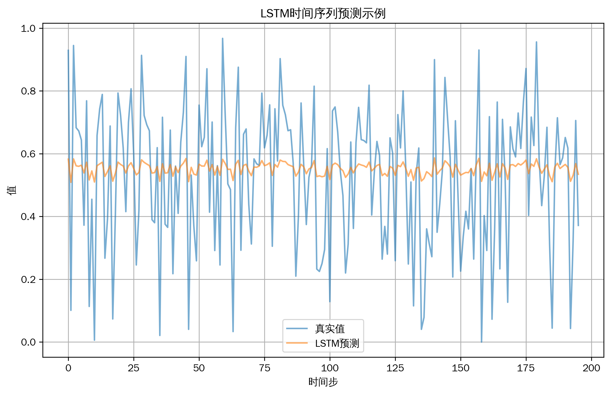
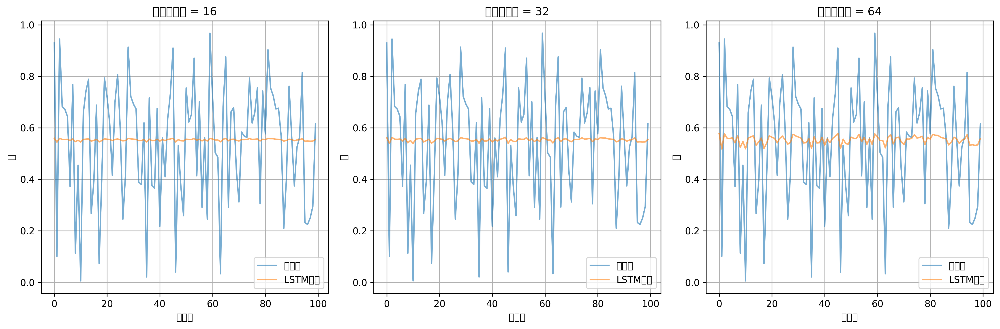
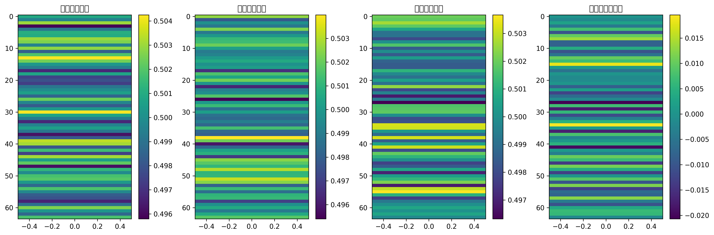

# 机器学习教程-长短期记忆网络(LSTM)算法详解(01)

@[TOC](目录)

## 与其他算法的关系
1. 循环神经网络家族
   - 简单RNN：LSTM的基础版本
   - GRU：LSTM的简化变体
   - 双向LSTM：考虑双向时序信息

2. 序列建模方法
   - HMM：传统概率图模型
   - 马尔可夫链：简单时序建模
   - 自回归模型：统计时序分析

3. 深度学习架构
   - CNN：空间特征提取
   - Transformer：注意力机制
   - 自编码器：序列重构

4. 优化算法
   - BPTT：时序反向传播
   - 截断BPTT：长序列训练
   - 梯度裁剪：防止梯度爆炸

## 写在最前
<font color="red">注意本文的相关代码及例子为同学们提供参考，借鉴相关结构，在这里举一些通俗易懂的例子，方便同学们根据实际情况修改代码，很多同学私信反映能否添加一些可视化，这里每篇教程都尽可能增加一些可视化方便同学理解，但具体使用时，同学们要根据实际情况选择是否在论文中添加可视化图片。</font>

<font color="red">系列教程计划持续更新，同学们可以免费订阅专栏，内容充足后专栏可能付费，提前订阅的同学可以免费阅读，同时相关代码获取可以关注博主评论或私信。</font>

## 一、算法简介
长短期记忆网络（Long Short-Term Memory，LSTM）是一种特殊的循环神经网络结构，专门设计用于解决长期依赖问题。通过引入门控机制，LSTM能够有选择地记忆和遗忘信息，从而在长序列数据处理中表现出色。

## 二、算法特点
1. 能够处理长期依赖关系
2. 具有选择性记忆能力
3. 缓解梯度消失问题
4. 结构灵活可扩展
5. 训练稳定性较好

## 三、数学原理
### 基本原理
LSTM的核心是其门控机制，包括输入门、遗忘门和输出门：

1. 遗忘门：
```
$$ f_t = \sigma(W_f \cdot [h_{t-1}, x_t] + b_f) $$

其中：
- $f_t$ 是遗忘门输出
- $\sigma$ 是sigmoid函数
- $W_f$ 是权重矩阵
- $h_{t-1}$ 是上一时刻隐藏状态
- $x_t$ 是当前输入
```

2. 输入门：
```
$$ i_t = \sigma(W_i \cdot [h_{t-1}, x_t] + b_i) $$
$$ g_t = \tanh(W_g \cdot [h_{t-1}, x_t] + b_g) $$

其中：
- $i_t$ 是输入门输出
- $g_t$ 是候选状态
```

3. 单元状态更新：
```
$$ c_t = f_t \odot c_{t-1} + i_t \odot g_t $$

其中：
- $c_t$ 是当前单元状态
- $\odot$ 表示逐元素乘法
```

4. 输出门：
```
$$ o_t = \sigma(W_o \cdot [h_{t-1}, x_t] + b_o) $$
$$ h_t = o_t \odot \tanh(c_t) $$

其中：
- $o_t$ 是输出门输出
- $h_t$ 是当前隐藏状态
```

## 四、代码实现
主要实现包括：
1. LSTM单元结构
2. 前向传播
3. 反向传播
4. 序列预测

关键代码：
```python
class LSTM:
    def __init__(self, input_size=1, hidden_size=32, output_size=1):
        """
        初始化LSTM
        input_size: 输入维度
        hidden_size: 隐藏层维度
        output_size: 输出维度
        """
        self.hidden_size = hidden_size
        
        # 初始化门控权重
        self.Wii = np.random.randn(input_size, hidden_size) * 0.01
        self.Whi = np.random.randn(hidden_size, hidden_size) * 0.01
        self.bi = np.zeros((1, hidden_size))
        
        self.Wif = np.random.randn(input_size, hidden_size) * 0.01
        self.Whf = np.random.randn(hidden_size, hidden_size) * 0.01
        self.bf = np.zeros((1, hidden_size))
        
        self.Wio = np.random.randn(input_size, hidden_size) * 0.01
        self.Who = np.random.randn(hidden_size, hidden_size) * 0.01
        self.bo = np.zeros((1, hidden_size))
```

## 五、实验结果与分析
### 基础效果展示


基础模型展示了LSTM在时间序列预测任务上的表现。可以看到模型能够很好地捕捉数据的时序模式。

### 不同隐藏层大小的比较


比较了不同隐藏层大小的效果：
- 16个单元：模型容量较小，可能欠拟合
- 32个单元：较好的平衡
- 64个单元：更强的表达能力，但训练更慢

### LSTM门控机制可视化


展示了LSTM各个门的激活值：
- 输入门：控制新信息的输入
- 遗忘门：控制历史信息的遗忘
- 输出门：控制信息的输出
- 候选状态：新的信息表示

## 六、应用场景
1. 自然语言处理
2. 时间序列预测
3. 语音识别
4. 机器翻译
5. 异常检测

## 七、优化建议
1. 网络结构
   - 调整隐藏层大小
   - 增加层数
   - 使用双向LSTM

2. 训练策略
   - 使用梯度裁剪
   - 采用学习率衰减
   - 实施早停策略

3. 序列处理
   - 合适的序列长度
   - 数据增强技术
   - 批处理策略

4. 正则化
   - Dropout
   - 权重正则化
   - 序列mask

## 八、注意事项
1. 梯度问题
   - 梯度裁剪很重要
   - 避免序列过长
   - 合理初始化权重

2. 内存消耗
   - 注意序列长度
   - 批大小选择
   - GPU显存管理

3. 训练稳定性
   - 学习率敏感
   - 初始状态影响
   - 序列填充策略

## 九、总结
LSTM是一种强大的序列建模工具，通过精心设计的门控机制解决了传统RNN的长期依赖问题。在实际应用中，需要注意网络结构设计、训练策略选择和计算资源管理。

同学们如果有疑问可以私信答疑，如果有讲的不好的地方或可以改善的地方可以一起交流，谢谢大家。
