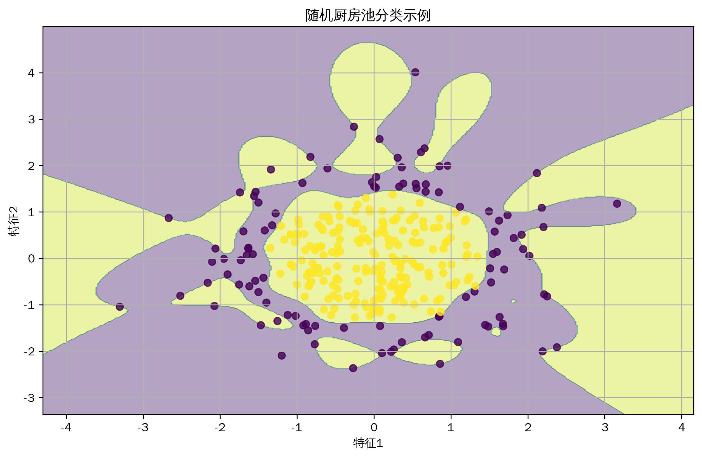
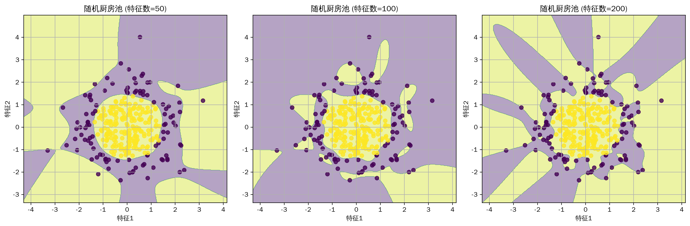
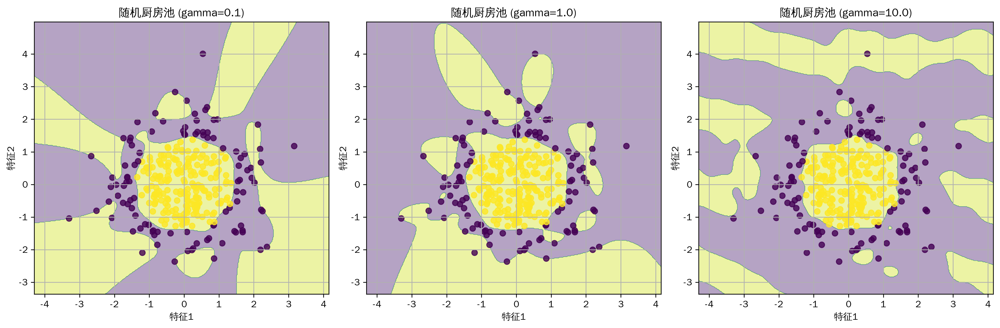

# 机器学习教程-随机厨房池(Random Kitchen Sink)算法详解(08)

## 与其他算法的关系
1. 核方法家族
   - SVM：显式核函数计算
   - 核岭回归：核技巧应用
   - Nyström方法：核矩阵近似

2. 随机投影
   - Johnson-Lindenstrauss引理
   - 局部敏感哈希
   - 随机傅里叶特征

3. 特征工程
   - 多项式特征：确定性变换
   - 傅里叶特征：频域变换
   - 小波变换：时频分析

4. 降维技术
   - PCA：线性降维
   - 随机投影：维度约简
   - 特征选择：显式降维

## 写在最前
<font color="red">注意本文的相关代码及例子为同学们提供参考，借鉴相关结构，在这里举一些通俗易懂的例子，方便同学们根据实际情况修改代码，很多同学私信反映能否添加一些可视化，这里每篇教程都尽可能增加一些可视化方便同学理解，但具体使用时，同学们要根据实际情况选择是否在论文中添加可视化图片。</font>

<font color="red">系列教程计划持续更新，同学们可以免费订阅专栏，内容充足后专栏可能付费，提前订阅的同学可以免费阅读，同时相关代码获取可以关注博主评论或私信。</font>

## 一、算法简介
随机厨房池（Random Kitchen Sink）是一种基于随机特征映射的核方法近似技术。它通过随机投影将输入数据映射到高维特征空间，从而实现非线性分类和回归。该方法的名字来源于"everything but the kitchen sink"这个俚语，暗示了其使用大量随机特征的特点。

## 二、算法特点
1. 高效的核方法近似
2. 可扩展性好
3. 理论保证完备
4. 易于实现和并行化
5. 适用于大规模数据

## 三、数学原理
### 基本原理
1. 随机特征映射：
```
z(x) = √(2/D)[cos(w₁ᵀx + b₁), ..., cos(wₘᵀx + bₘ)]
其中：
- x 是输入向量
- wᵢ 是随机权重向量
- bᵢ 是随机偏置
- D 是特征维度
```

2. 核函数近似：
```
k(x,y) ≈ z(x)ᵀz(y)
其中：
- k(x,y) 是目标核函数
- z(·) 是随机特征映射
```

3. 优化目标：
```
min ||K - ZZᵀ||_F
其中：
- K 是核矩阵
- Z 是随机特征矩阵
- ||·||_F 是Frobenius范数
```

## 四、代码实现
主要实现包括：
1. 随机特征生成
2. 线性模型训练
3. 预测和可视化

关键代码：
```python
def generate_random_features(X, n_features=1000, gamma=1.0):
    """
    生成随机厨房池特征
    X: 输入数据
    n_features: 随机特征的数量
    gamma: RBF核参数
    """
    n_samples, n_dims = X.shape
    
    # 生成随机投影矩阵
    W = np.random.normal(0, np.sqrt(2 * gamma), (n_dims, n_features))
    b = np.random.uniform(0, 2 * np.pi, n_features)
    
    # 计算随机特征
    Z = np.sqrt(2.0 / n_features) * np.cos(X @ W + b)
    
    return Z
```

## 五、实验结果与分析
### 基础效果展示


基础模型展示了随机厨房池在非线性分类问题上的表现。可以看到模型成功学习到了数据的非线性决策边界。

### 不同特征数量的比较


比较了不同数量随机特征的效果：
- 50个特征：近似较粗糙
- 100个特征：较好的平衡
- 200个特征：更精细的近似

### gamma参数的影响


展示了不同gamma值的影响：
- 小gamma：决策边界更平滑
- 中等gamma：较好的平衡
- 大gamma：决策边界更复杂

## 六、应用场景
1. 大规模核方法
2. 非线性分类
3. 回归问题
4. 特征工程
5. 在线学习

## 七、优化建议
1. 特征选择
   - 特征数量选择
   - gamma参数调优
   - 随机种子设置

2. 计算优化
   - 批量处理
   - GPU加速
   - 并行计算

3. 数值稳定性
   - 特征标准化
   - 数值精度控制
   - 条件数优化

4. 模型集成
   - 多次随机特征
   - 投票机制
   - 模型平均

## 八、注意事项
1. 计算复杂度
   - 特征数量与性能
   - 内存消耗
   - 计算时间

2. 随机性影响
   - 结果稳定性
   - 多次运行差异
   - 随机种子选择

3. 参数敏感性
   - gamma参数影响
   - 特征数量选择
   - 模型稳定性

## 九、总结
随机厨房池是一种高效的核方法近似技术，通过随机特征映射实现非线性建模。它在保持核方法优势的同时，显著提高了计算效率和可扩展性。在实际应用中，需要注意特征数量和参数选择的平衡。

同学们如果有疑问可以私信答疑，如果有讲的不好的地方或可以改善的地方可以一起交流，谢谢大家。
