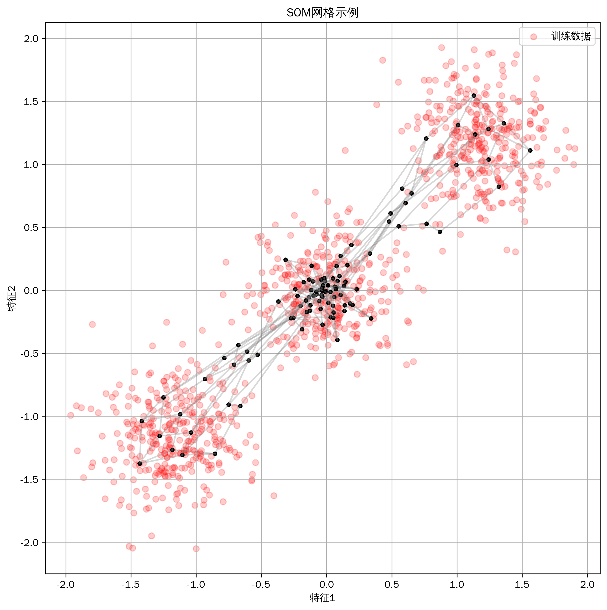
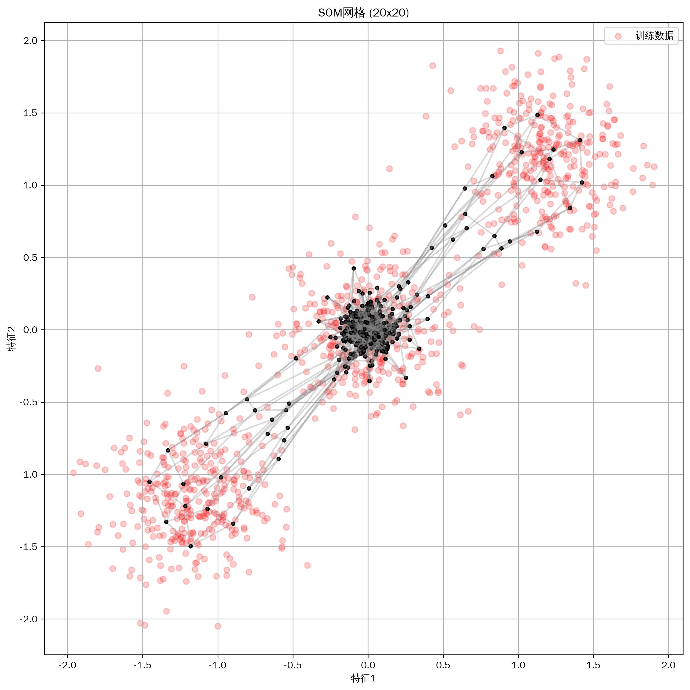
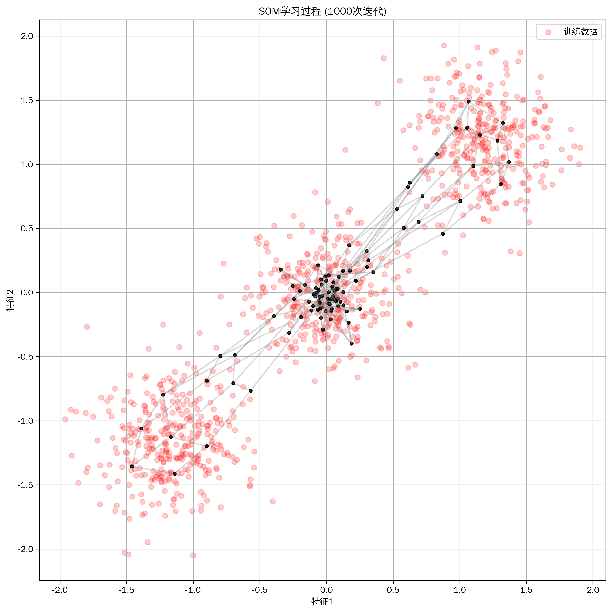

# 机器学习教程-自组织映射(SOM)算法详解(10)

## 与其他算法的关系
1. 神经网络家族
   - 竞争学习网络：SOM的基础
   - 反向传播网络：有监督学习
   - Hopfield网络：联想记忆

2. 聚类算法
   - K-means：基于质心的聚类
   - DBSCAN：基于密度的聚类
   - 层次聚类：基于层次的聚类

3. 降维方法
   - PCA：线性降维
   - t-SNE：非线性降维
   - UMAP：流形学习

4. 可视化技术
   - 散点图矩阵：高维数据展示
   - 平行坐标图：多维特征可视化
   - 热力图：权重分布展示

## 写在最前
<font color="red">注意本文的相关代码及例子为同学们提供参考，借鉴相关结构，在这里举一些通俗易懂的例子，方便同学们根据实际情况修改代码，很多同学私信反映能否添加一些可视化，这里每篇教程都尽可能增加一些可视化方便同学理解，但具体使用时，同学们要根据实际情况选择是否在论文中添加可视化图片。</font>

<font color="red">系列教程计划持续更新，同学们可以免费订阅专栏，内容充足后专栏可能付费，提前订阅的同学可以免费阅读，同时相关代码获取可以关注博主评论或私信。</font>

## 一、算法简介
自组织映射（Self-Organizing Map，SOM）是一种无监督学习的神经网络，通过竞争学习实现输入空间到低维网格的映射。它能够保持数据的拓扑结构，广泛应用于数据可视化和聚类分析。

## 二、算法特点
1. 保持数据拓扑结构
2. 自适应学习能力
3. 可视化效果直观
4. 无监督学习方式
5. 降维和聚类双重功能

## 三、数学原理
### 基本原理
1. 竞争学习：
```
BMU = argmin ||x - wᵢ||
其中：
- x 是输入向量
- wᵢ 是第i个神经元的权重向量
- BMU 是最佳匹配单元
```

2. 权重更新：
```
wᵢ(t+1) = wᵢ(t) + α(t)h(r,t)[x(t) - wᵢ(t)]
其中：
- α(t) 是学习率
- h(r,t) 是邻域函数
- t 是时间步
```

3. 邻域函数：
```
h(r,t) = exp(-||r - rₖ||² / (2σ(t)²))
其中：
- r 是当前神经元的位置
- rₖ 是获胜神经元的位置
- σ(t) 是邻域半径
```

## 四、代码实现
主要实现包括：
1. 网络结构定义
2. 竞争学习过程
3. 权重更新规则
4. 可视化方法

关键代码：
```python
class SOM:
    def __init__(self, map_size=(10, 10), n_features=2):
        """
        初始化SOM网络
        map_size: 输出层网格大小
        n_features: 输入特征维度
        """
        self.map_size = map_size
        self.n_features = n_features
        self.weights = np.random.randn(map_size[0], map_size[1], n_features)
```

## 五、实验结果与分析
### 基础效果展示


基础模型展示了SOM在二维数据上的映射效果。可以看到网络成功学习到了数据的拓扑结构。

### 不同网格大小的比较


比较了不同网格大小的效果：
- 5x5：粗粒度映射
- 10x10：中等精度
- 20x20：细粒度映射

### 学习过程可视化


展示了SOM的学习过程：
- 初始状态：随机权重
- 粗调阶段：大范围调整
- 精调阶段：局部优化
- 最终状态：稳定映射

## 六、应用场景
1. 数据可视化
2. 模式识别
3. 图像分割
4. 文本聚类
5. 异常检测

## 七、优化建议
1. 网络结构
   - 选择合适的网格大小
   - 调整学习率衰减
   - 优化邻域函数

2. 训练策略
   - 批量训练
   - 自适应学习率
   - 多次随机初始化

3. 可视化方法
   - U-matrix可视化
   - 分量平面图
   - 轨迹图

4. 性能优化
   - 并行计算
   - 数据预处理
   - 早停策略

## 八、注意事项
1. 参数选择
   - 网格大小影响
   - 学习率设置
   - 邻域范围调整

2. 训练稳定性
   - 初始化敏感
   - 收敛判断
   - 学习率衰减

3. 计算效率
   - 数据规模
   - 迭代次数
   - 内存消耗

## 九、总结
SOM是一种强大的无监督学习工具，通过竞争学习实现数据的降维和可视化。它能够保持数据的拓扑结构，在数据分析和模式识别中有广泛应用。在实际使用中，需要注意参数选择和训练策略的优化。

同学们如果有疑问可以私信答疑，如果有讲的不好的地方或可以改善的地方可以一起交流，谢谢大家。
