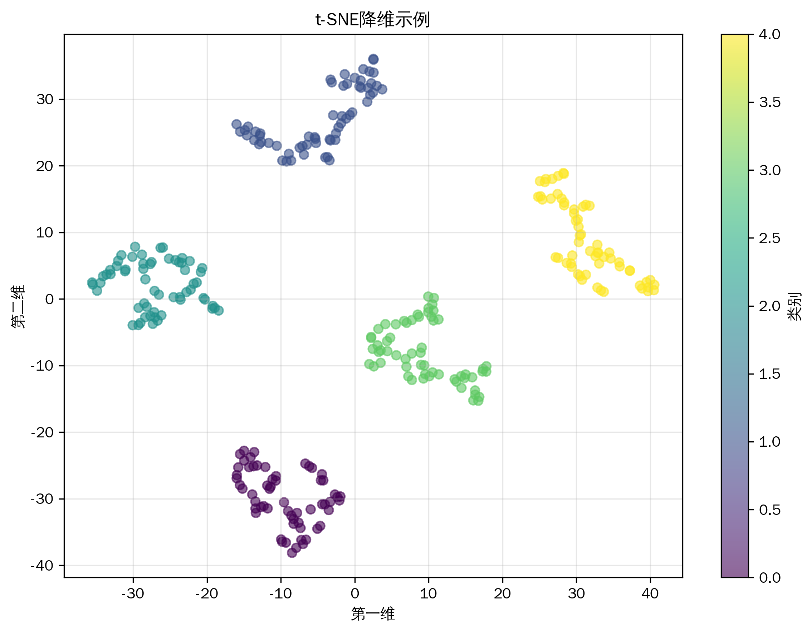
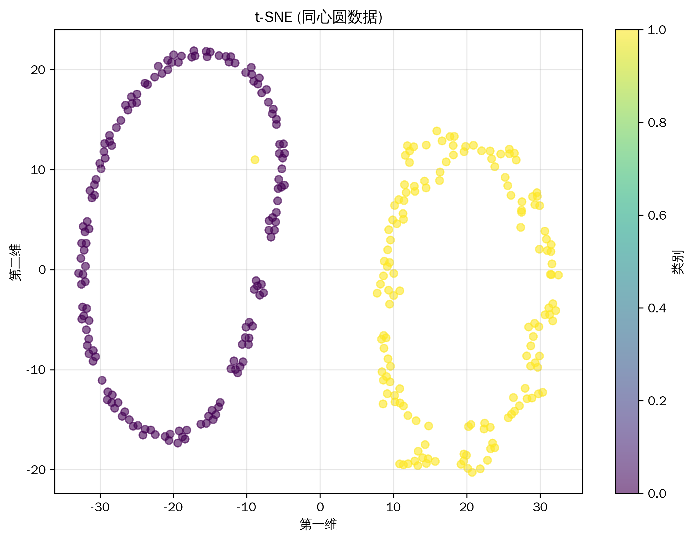
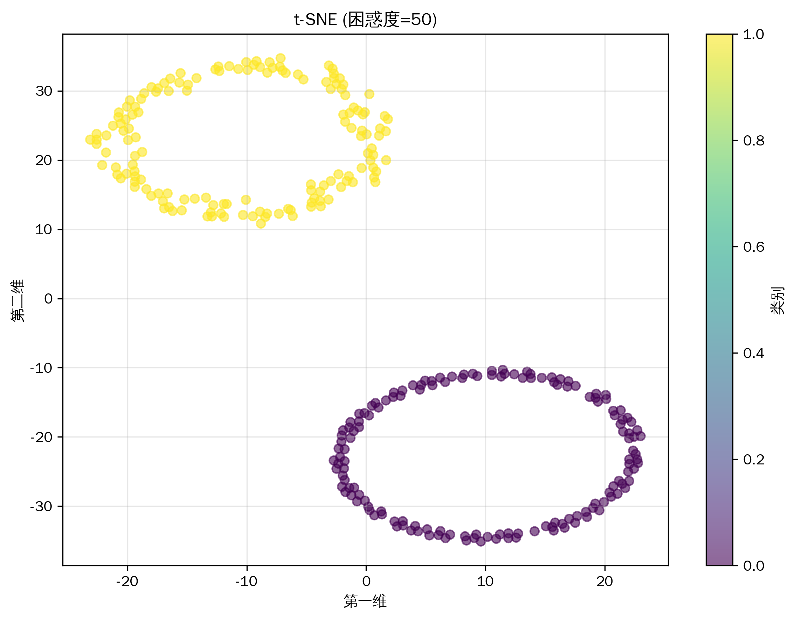
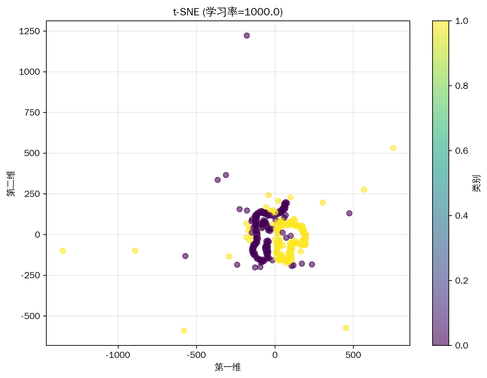

# 机器学习教程-t分布随机邻域嵌入(t-SNE)算法详解(06)

## 与其他算法的关系
1. 降维算法家族
   - PCA：线性降维的基准方法
   - LLE：局部线性嵌入
   - UMAP：现代流形学习方法

2. 可视化技术
   - MDS：多维尺度分析
   - Isomap：测地线距离映射
   - 自编码器：神经网络降维

3. 概率模型
   - SNE：随机邻域嵌入
   - GPLVM：高斯过程隐变量模型
   - RBM：受限玻尔兹曼机

4. 优化算法
   - 梯度下降：基础优化方法
   - 动量优化：加速收敛
   - 自适应学习率：参数调节

## 写在最前
<font color="red">注意本文的相关代码及例子为同学们提供参考，借鉴相关结构，在这里举一些通俗易懂的例子，方便同学们根据实际情况修改代码，很多同学私信反映能否添加一些可视化，这里每篇教程都尽可能增加一些可视化方便同学理解，但具体使用时，同学们要根据实际情况选择是否在论文中添加可视化图片。</font>

<font color="red">系列教程计划持续更新，同学们可以免费订阅专栏，内容充足后专栏可能付费，提前订阅的同学可以免费阅读，同时相关代码获取可以关注博主评论或私信。</font>

## 一、算法简介
t-SNE（t-distributed Stochastic Neighbor Embedding）是一种非线性降维算法，特别适合于高维数据的可视化。它通过将数据点之间的高维空间相似度转换为低维空间的距离来保持数据的局部结构，同时在低维空间使用t分布来避免"拥挤问题"。

## 二、算法特点
1. 保持局部结构
2. 非线性降维能力强
3. 可视化效果优秀
4. 计算复杂度较高
5. 对参数敏感

## 三、数学原理
### 基本原理
1. 高维空间概率分布：
```
pⱼ|ᵢ = exp(-||xᵢ-xⱼ||²/2σᵢ²) / ∑ₖ≠ᵢexp(-||xᵢ-xₖ||²/2σᵢ²)
pᵢⱼ = (pⱼ|ᵢ + pᵢ|ⱼ) / 2n
```

2. 低维空间概率分布：
```
qᵢⱼ = (1 + ||yᵢ-yⱼ||²)⁻¹ / ∑ₖ≠ₗ(1 + ||yₖ-yₗ||²)⁻¹
```

3. 目标函数（KL散度）：
```
C = ∑ᵢ∑ⱼpᵢⱼlog(pᵢⱼ/qᵢⱼ)
```

### 优化过程
1. 梯度计算：
```
∂C/∂yᵢ = 4∑ⱼ(pᵢⱼ - qᵢⱼ)(yᵢ - yⱼ)(1 + ||yᵢ-yⱼ||²)⁻¹
```

2. 动量更新：
```
v(t) = αv(t-1) - η∂C/∂Y
Y(t) = Y(t-1) + v(t)
```

## 四、代码实现
主要实现包括：
1. 概率分布计算
2. 梯度优化
3. 可视化展示

关键代码：
```python
def _compute_joint_probabilities(self, D):
    """计算高维空间的联合概率分布"""
    P = np.zeros((D.shape[0], D.shape[0]))
    beta = np.ones(D.shape[0])
    logU = np.log(self.perplexity)
    
    for i in range(D.shape[0]):
        # 二分搜索找到合适的beta
        betamin = -np.inf
        betamax = np.inf
        Di = D[i, np.concatenate((np.r_[0:i], np.r_[i+1:D.shape[0]]))]
        
        for _ in range(50):
            H, Pi = self._compute_entropy(Di, beta[i])
            Hdiff = H - logU
            
            if np.abs(Hdiff) < 1e-5:
                break
            
            if Hdiff > 0:
                betamin = beta[i]
                beta[i] = beta[i] * 2 if betamax == np.inf else (beta[i] + betamax) / 2
            else:
                betamax = beta[i]
                beta[i] = beta[i] / 2 if betamin == -np.inf else (beta[i] + betamin) / 2
        
        P[i, np.concatenate((np.r_[0:i], np.r_[i+1:D.shape[0]]))] = Pi
    
    return (P + P.T) / (2 * D.shape[0])
```

## 五、实验结果与分析
### 基础效果展示


基础模型展示了t-SNE在高斯分布数据上的降维效果。可以看到算法成功地将数据点按照其内在结构进行了聚类，保持了数据的局部关系。

### 不同数据集的比较


比较了不同类型数据集的降维效果：
- 高斯分布：清晰的簇状结构
- 新月形：保持了弯曲结构
- 同心圆：维持了环形特征

### 困惑度参数的影响


展示了不同困惑度值的效果：
- 小困惑度：关注更局部的结构
- 中等困惑度：平衡局部和全局
- 大困惑度：保持更多全局结构

### 学习率的影响


展示了不同学习率的影响：
- 小学习率：收敛慢但稳定
- 中等学习率：较好的平衡
- 大学习率：收敛快但可能不稳定

## 六、应用场景
1. 高维数据可视化
2. 特征提取与降维
3. 聚类分析辅助
4. 生物信息学
5. 图像处理

## 七、优化建议
1. 参数选择
   - 困惑度选择
   - 学习率调整
   - 迭代次数设置

2. 初始化策略
   - PCA初始化
   - 随机初始化
   - 多次运行选择最优

3. 计算优化
   - Barnes-Hut近似
   - GPU加速
   - 批量处理

4. 可视化增强
   - 交互式探索
   - 渐进式计算
   - 多视图联动

## 八、注意事项
1. 计算复杂度
   - O(n²)时间复杂度
   - 大规模数据处理困难
   - 内存消耗大

2. 结果稳定性
   - 随机初始化影响
   - 参数敏感性
   - 多次运行差异

3. 解释性问题
   - 距离保持非线性
   - 全局结构可能失真
   - 旋转不变性

## 九、总结
t-SNE是一种强大的非线性降维算法，特别适合于高维数据的可视化。它通过保持数据点之间的局部关系，能够揭示数据的内在结构。在实际应用中，需要注意参数选择和计算效率的问题，同时考虑使用优化策略来提高算法性能。

同学们如果有疑问可以私信答疑，如果有讲的不好的地方或可以改善的地方可以一起交流，谢谢大家。
